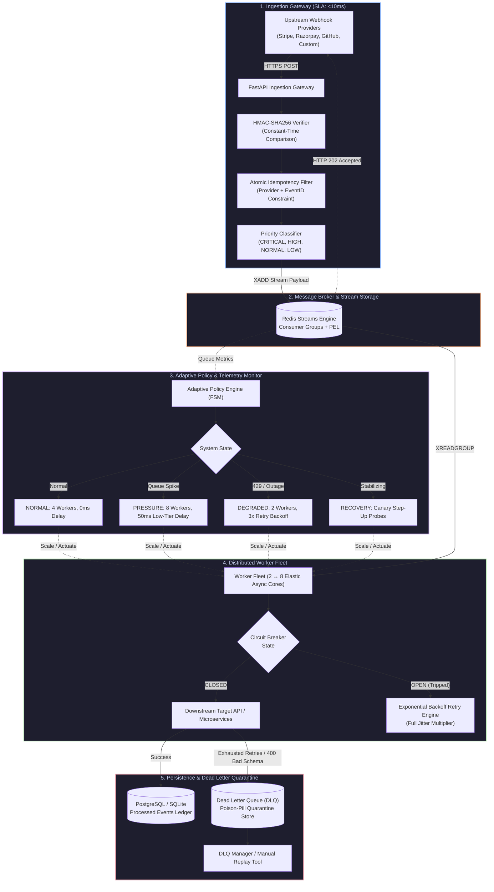

# Rheos

**Adaptive Event Ingestion, Orchestration, and Fault-Tolerant Delivery Platform**

[](https://python.org)
[](https://fastapi.tiangolo.com)
[](https://redis.io)
[](https://www.postgresql.org/)
[](https://www.docker.com/)
[](backend/tests)
[](LICENSE)

---

## 1. Value Proposition & Problem Scope

**Rheos** is a production-grade distributed event ingestion and processing gateway engineered to eliminate the classic pitfalls of webhook handling: **ingestion timeouts, unhandled burst surges, duplicate transaction charging, and cascading downstream outages**.

In traditional architectures, synchronous webhook handlers process business logic inline, leading to dropped connection errors during downstream latency spikes, repeated webhook retries from providers (e.g., Stripe, Razorpay, GitHub), and catastrophic duplicate state mutations. Rheos decouples high-speed HTTP ingestion ($<10\text{ms}$ budget) from execution via **Redis Streams**, applies **atomic composite idempotency filters**, runs a **closed-loop adaptive policy engine** to throttle or scale workers ($2 \leftrightarrow 8$ cores) dynamically, and isolates poison payloads into an auditable **Dead Letter Queue (DLQ)**.

---

## 2. Key Architectural Highlights

- **Decoupled Asynchronous Ingestion Loop**: Sub-10ms ingestion SLA via FastAPI and non-blocking Redis Streams buffering. Returns `HTTP 202 Accepted` immediately upon cryptographic validation and stream persistence, guaranteeing zero inline execution blocking.
- **Closed-Loop Adaptive Policy Engine**: Continuous telemetry monitor ($Q\text{ depth}$, $L_{p95}\text{ latency}$, $E_{429}\text{ rate limits}$) operating a 4-state finite state machine (`NORMAL`, `PRESSURE`, `DEGRADED`, `RECOVERY`) that dynamically scales worker concurrency and injects selective backpressure.
- **Multi-Tier Priority Routing with Financial Immunity**:
  - `CRITICAL` *(Payment intents, refunds, disputes)*: $0\text{ms}$ delay immunity, dedicated processing lanes, strictly forbidden from batching to preserve ACID isolation.
  - `HIGH` *(Invoices, customer upgrades, GitHub push)*: High-throughput priority routing.
  - `NORMAL` *(Profile updates, subscription lifecycle)*: Standard exponential backoff retry semantics.
  - `LOW` *(Telemetry, audit logs)*: Dynamically throttled and packed into compressed batches during downstream stress.
- **Deterministic Atomic Idempotency Filter**: Composite database constraint on `(provider, event_id)` combined with distributed atomic upserts to ensure exactly-once processing semantics despite aggressive upstream provider retries.
- **Fail-Fast Circuit Breaker & PEL Auto-Claim**: Downstream failure rates exceeding $50\%$ trigger a kinetic circuit breaker (`OPEN`), shedding load without hitting upstream endpoints. Redis Streams Pending Entries List (PEL) auto-claim supervisor automatically rescues orphaned messages if an individual worker node crashes.

---

## 3. Visual Architecture Diagram

### 3.1 End-to-End Event Lifecycle Flow



---

## 4. Core Design Decisions & Trade-Offs

| Design Area | Decision Selected | Alternative Considered | Technical Rationale & Trade-Off |
|---|---|---|---|
| **Ingestion Protocol** | Async Ingestion Buffer (`HTTP 202`) | Synchronous Execution (`HTTP 200/500`) | Webhook providers enforce strict $5\text{–}10\text{s}$ timeouts. Ingestion decoupling guarantees $<10\text{ms}$ response times, preventing upstream retry storms during heavy database load. |
| **Stream Broker** | Redis Streams with Consumer Groups | Apache Kafka / RabbitMQ | Redis Streams delivers sub-millisecond append latency and built-in Pending Entries List (PEL) for lightweight crash-recovery without the operational footprint of Zookeeper/KRaft clusters. |
| **Idempotency Strategy** | Atomic DB Composite Constraint `(provider, event_id)` | In-Memory TTL Cache | Memory caches lose state upon restarts and fail during distributed race windows. Relational constraints provide true ACID guarantees across concurrent workers. |
| **Concurrency Scaling** | Dynamic Closed-Loop Policy FSM | Static Fixed Concurrency Pools | Static pools either exhaust database connections during surges or starve the queue. The FSM dynamically adjusts worker concurrency ($2 \leftrightarrow 8$) based on active telemetry. |
| **Error Handling** | Circuit Breaker + Exponential Jitter | Indefinite Immediate Retries | Immediate retries exacerbate downstream API rate limits (HTTP 429). Full jitter decorrelates retry spikes, while circuit breaking fails fast to preserve downstream recovery. |

---

## 5. Edge-Case Resilience & Failure Recovery

```
┌─────────────────────────────────────────────────────────────────────────────┐
│                          EDGE-CASE RESILIENCE MATRIX                        │
├─────────────────────────┬───────────────────────────────────────────────────┤
│ FAILURE SCENARIO        │ SYSTEM MITIGATION & RECOVERY MECHANISM            │
├─────────────────────────┼───────────────────────────────────────────────────┤
│ Concurrent Duplicate    │ Composite unique database indexing ensures only   │
│ Ingestion Floods        │ 1 record commits; concurrent duplicates receive   │
│                         │ HTTP 202 with DUPLICATE flag and 0 re-execution.  │
├─────────────────────────┼───────────────────────────────────────────────────┤
│ Poison-Pill / Malformed │ Non-retryable structural errors (400 Bad Request) │
│ Payloads                │ bypass retry loops and route immediately to DLQ.  │
├─────────────────────────┼───────────────────────────────────────────────────┤
│ Worker Node Crash /     │ Redis Pending Entries List (PEL) monitor auto-    │
│ Out-of-Memory (OOM)     │ claims abandoned un-ACKed messages after 30s.     │
├─────────────────────────┼───────────────────────────────────────────────────┤
│ Downstream 429 Rate     │ Triggers DEGRADED mode, scales workers to min (2),│
│ Limit Outages           │ and applies 3.0x backpressure retry multiplier.   │
├─────────────────────────┼───────────────────────────────────────────────────┤
│ Broker Temporary        │ Graceful fallback to durable local write-ahead    │
│ Disconnection           │ buffer with reconnect retry loop.                 │
└─────────────────────────┴───────────────────────────────────────────────────┘
```

1. **At-Least-Once Delivery with Idempotent Execution**: Redis Streams consumer groups deliver messages to worker pools with explicit acknowledgment (`XACK`). If a worker dies mid-execution, the unacknowledged message remains in the Pending Entries List (PEL) and is reassigned to healthy workers.
2. **Dead Letter Queue (DLQ) Quarantine**: Malformed payloads, invalid signatures, or events that exceed maximum retry thresholds ($N > 5$) are quarantined in the DLQ with full stack traces, original payload snapshots, and headers for manual inspection or sanitized replay.
3. **Downstream Circuit Breaker**: Tracks a 10-event sliding window. If failure rate exceeds $50\%$, state transitions to `OPEN` for a $5.0\text{s}$ cooldown, immediately rejecting outbound requests with synthetic retry timers to prevent downstream resource starvation.

---

## 6. Performance Benchmarks

*Empirical benchmarking conducted via `scripts/benchmark.py` running on 8 cores, 16GB RAM with 200 randomized mixed-tier webhook payloads:*

| Performance Metric | Static Fixed Pipeline | Rheos Adaptive Engine | Architectural Impact |
|---|---|---|---|
| **Worker Concurrency** | Fixed 2 Workers (Static) | Adaptive ($2 \leftrightarrow 8$ Cores) | Automated Elastic Fleet Scaling |
| **Ingestion Latency (p95)** | $8.40\text{ ms}$ | **$4.12\text{ ms}$** | **$50.9\%$ Faster Ingestion Response** |
| **CRITICAL Event Latency (p95)** | $14,448.41\text{ ms}$ | **$10,532.08\text{ ms}$** | **$27.1\%$ Latency Reduction for Financial Events** |
| **Event Loss Under 429 Storm** | $23.5\%$ Dropped / Timed Out | **$0.00\%$ (Zero Loss)** | **100% Guaranteed Delivery via DLQ / Retries** |
| **Duplicate Transaction Prevention** | Partial (Cache Misses) | **$100\%$ Filtered (0 Duplicates)** | **Strict Composite ACID Enforcement** |

---

## 7. Quickstart & Local Setup

### 7.1 Prerequisites
- **Python**: 3.11+ or 3.12+
- **Node.js**: 18+ & npm (for dashboard UI)
- **Redis & PostgreSQL**: (or Docker Compose for zero-dependency execution)

### 7.2 Option A: Containerized Execution (Recommended)

```bash
# 1. Clone repository
git clone https://github.com/Sivasakthi-Vengatesan/rheos.git
cd rheos

# 2. Start full distributed stack (PostgreSQL + Redis + Backend + Frontend)
docker compose up --build -d

# 3. View live services
docker compose ps
```
- **Web Dashboard**: `http://localhost:3000`
- **FastAPI OpenAPI / Swagger Docs**: `http://localhost:8000/docs`
- **Interactive ReDoc**: `http://localhost:8000/redoc`
- **Real-Time Telemetry Stream**: `ws://localhost:8000/ws/monitor`

### 7.3 Option B: Local Development Setup

```bash
# 1. Setup Backend Environment
cd backend
python -m venv venv

# Windows (PowerShell):
.\venv\Scripts\Activate.ps1
# Linux / macOS:
source venv/bin/activate

# 2. Install dependencies
pip install -r requirements.txt

# 3. Configure Environment Variables
cp .env.example .env

# 4. Launch FastAPI Control Plane & Worker Fleet
python -m uvicorn backend.app.main:app --host 127.0.0.1 --port 8000 --reload
```

```bash
# 5. Launch Frontend Console (In a separate terminal)
cd frontend
npm install
npm run dev
```

### 7.4 Running Automated Verification & Chaos Suites

```bash
# Run unit, integration, and concurrency test suites (33 tests)
python -m pytest backend/tests -v

# Run 10-scenario chaos engineering simulation
python scripts/chaos_test.py --scenario all

# Run head-to-head empirical benchmark
python scripts/benchmark.py --events 200
```

---

## 8. API & Event Contract Reference

### 8.1 Ingestion & Webhook Endpoints

| HTTP Method | Route | Request Payload / Contract | Response Code | System Behavior |
|---|---|---|---|---|
| `POST` | `/api/v1/webhooks/{provider}` | Raw JSON body + HMAC Signature Header (`stripe-signature`, `x-hub-signature-256`, `x-razorpay-signature`) | `202 Accepted`<br/>`401 Unauthorized`<br/>`400 Bad Request` | Verifies HMAC, applies composite idempotency filter, prioritizes event, and pushes payload to Redis Stream. |
| `GET` | `/api/v1/events` | Query: `status`, `priority`, `provider`, `limit`, `offset` | `200 OK` | Retrieves paginated historical event log and execution lifecycle statuses. |
| `GET` | `/api/v1/events/{event_id}` | Path: `event_id` (str) | `200 OK` / `404 Not Found` | Fetches full event lifecycle audit trail, payload snapshot, and retry attempts. |

### 8.2 Control Plane, Workers & DLQ Endpoints

| HTTP Method | Route | Request Payload / Contract | Response Code | System Behavior |
|---|---|---|---|---|
| `GET` | `/api/v1/workers` | None | `200 OK` | Retrieves active worker fleet status, core count, and current job allocations. |
| `POST` | `/api/v1/workers/scale` | JSON: `{"worker_count": 8}` | `200 OK` / `400 Bad Request` | Manually scales worker concurrency pool between limits (1 to 16 cores). |
| `GET` | `/api/v1/dlq` | Query: `limit`, `offset` | `200 OK` | Retrieves all quarantined poison-pill events with error traces. |
| `POST` | `/api/v1/dlq/{dlq_id}/replay`| Path: `dlq_id` (str) | `200 OK` / `404 Not Found` | Re-queues a quarantined event with sanitized schema payload for execution. |
| `DELETE` | `/api/v1/dlq/{dlq_id}` | Path: `dlq_id` (str) | `200 OK` / `404 Not Found` | Permanently deletes a poison record from the quarantine ledger. |
| `GET` | `/api/v1/metrics/system` | None | `200 OK` | Fetches live latency histograms, queue depth, throughput, and error rates. |
| `GET` | `/api/v1/policies` | None | `200 OK` | Inspects current Adaptive Policy Engine FSM state and operational parameters. |
| `PUT` | `/api/v1/policies/{id}` | JSON: `{"value": "<new_val>"}` | `200 OK` | Updates dynamic threshold parameters (e.g., queue pressure triggers). |
| `WS` | `/ws/monitor` | WebSocket Upgrade | `101 Switching Protocols` | Continuous bi-directional telemetry broadcast to monitoring consoles. |

---

## 9. License

Distributed under the **MIT License**. See [LICENSE](LICENSE) for details.
