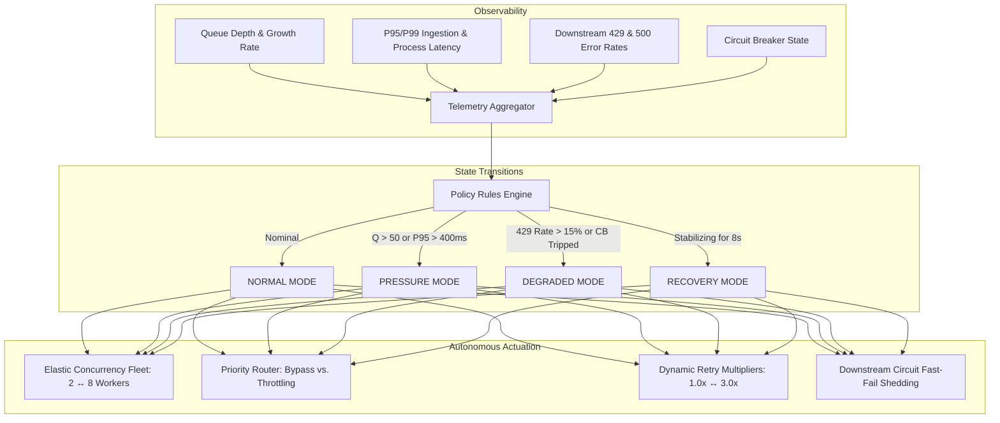
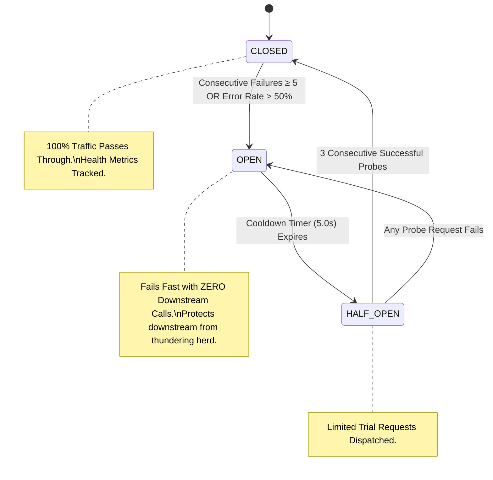

# Rheos — Adaptive Event Policy Engine Specification

> **Autonomous Closed-Loop Feedback Control for Distributed Reliability**

---

## 1. Motivation: The Static Distributed Processing Failure

Traditional event-driven worker pools rely on static parameters:
- **Fixed Concurrency**: Fixed number of worker threads/processes regardless of queue depth.
- **Uniform FIFO Processing**: Critical payment alerts compete equally with marketing analytics.
- **Blind Exponential Retries**: Workers retry failed endpoints aggressively, worsening downstream outages.
- **No Circuit Breaking**: Outages cause connection exhaustion across all worker threads.

Rheos solves this with an **Adaptive Policy Engine** that treats event reliability as a dynamic closed-loop control problem.



---

## 2. Mathematical Thresholds & State Transition Rules

The system state $\mathcal{S}(t) \in \{\text{NORMAL}, \text{PRESSURE}, \text{DEGRADED}, \text{RECOVERY}\}$ is computed continuously at interval $\Delta t = 1.0\text{s}$ based on vector:
$$\mathbf{X}(t) = \big( Q(t), \, \Delta Q(t), \, L_{p95}(t), \, E_{429}(t), \, \Omega_{CB}(t) \big)$$

### 2.1 State Matrix Definitions

| System Mode | Trigger Conditions | Concurrency Target | Backpressure Delay | Retry Multiplier | Batching Policy |
| :--- | :--- | :--- | :--- | :--- | :--- |
| **NORMAL** | $Q < 50 \land L_{p95} < 400\text{ms} \land E_{429} < 0.15 \land \Omega_{CB} = \text{CLOSED}$ | $4\text{ workers}$ | $0\text{ms}$ | $1.0\times$ | Standard |
| **PRESSURE** | $Q \ge 50 \lor \Delta Q > 15/\text{s} \lor L_{p95} \ge 400\text{ms}$ | **Scale UP** to $8\text{ workers}$ | $50\text{ms}$ (Low only) | $1.5\times$ | Low-Tier Batched |
| **DEGRADED** | $E_{429} \ge 0.15 \lor \Omega_{CB} \in \{\text{OPEN}, \text{HALF\_OPEN}\}$ | **Clamp DOWN** to $2\text{ workers}$ | $300\text{ms}$ (Low/Norm) | $3.0\times$ | Max Compression |
| **RECOVERY** | Sustained healthy metrics for $T_{rec} \ge 8.0\text{s}$ | **Step UP** to $4\text{ workers}$ | $20\text{ms}$ | $1.2\times$ | Half-Open Probes |

---

## 3. Multi-Tier Priority Classification & Invariants

```
┌────────────────────────────────────────────────────────────────────────┐
│                        PRIORITY ROUTING MATRIX                         │
├──────────┬──────────────────────┬─────────────┬───────────┬────────────┤
│ Priority │ Sample Event Types   │ Backpressure│ Batching  │ Max Retries│
├──────────┼──────────────────────┼─────────────┼───────────┼────────────┤
│ CRITICAL │ payment.succeeded    │ IMMUNE      │ FORBIDDEN │ 5          │
│          │ charge.refunded      │ (0ms delay) │ (ACID)    │            │
├──────────┼──────────────────────┼─────────────┼───────────┼────────────┤
│ HIGH     │ invoice.paid         │ Minimal     │ FORBIDDEN │ 3          │
│          │ github.push          │ (≤ 10ms)    │           │            │
├──────────┼──────────────────────┼─────────────┼───────────┼────────────┤
│ NORMAL   │ customer.updated     │ Dynamic     │ Allowed in│ 3          │
│          │ github.pull_request  │ (0 - 100ms) │ Recovery  │            │
├──────────┼──────────────────────┼─────────────┼───────────┼────────────┤
│ LOW      │ analytics.tracked    │ Shed / Delay│ ENABLED   │ 2          │
│          │ audit.log / ping     │ (Up to 300ms(Chunks of 10)         │
└──────────┴──────────────────────┴─────────────┴───────────┴────────────┘
```

### Safety Invariants
1. **Financial Isolation Guarantee**: Events classified as `CRITICAL` never wait in backpressure queues and are strictly forbidden from batching, preventing multi-event rollback failures.
2. **Elastic Scaling Bounds**: Worker count is strictly bounded $[W_{min}=2, \, W_{max}=8]$ to prevent host resource exhaustion.
3. **No Deadlocks**: Priority queues use independent stream channels or sorted indices ensuring low-priority starvation never blocks high-priority delivery.

---

## 4. Downstream Circuit Breaker Finite State Machine

To protect downstream partner APIs from cascading outage collapse during database crashes or network failures:



---

## 5. Explainable Decision Audit Ledger

Every mode transition and policy actuation generates an append-only, explainable audit record in the `policy_decisions` table:

```json
{
  "decision_id": "dec_849201",
  "timestamp": "2026-09-09T17:58:05.120Z",
  "previous_mode": "NORMAL",
  "target_mode": "PRESSURE",
  "trigger_reason": "Queue depth (62) exceeded threshold (50)",
  "triggering_metric": "queue_depth",
  "observed_value": 62.0,
  "threshold": 50.0,
  "action": "SCALE_CONCURRENCY_UP",
  "old_parameter": "4",
  "new_parameter": "8"
}
```
This enables complete post-incident root cause attribution and real-time observability across the fleet.
