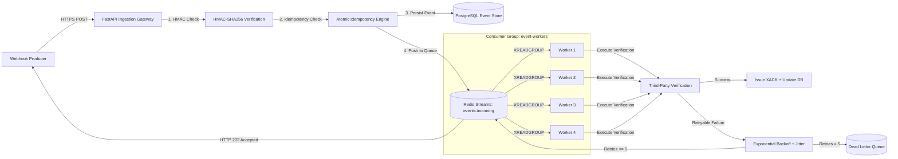

# EventForge Architecture Specification

## Overview

EventForge is an asynchronous webhook ingestion and processing gateway. It decouples high-throughput external webhook delivery from slower downstream business logic and third-party APIs.

---

## 1. Webhook Ingestion Gateway

- **Fast Non-Blocking Response**: The gateway validates the perimeter HMAC signature, checks the idempotency store, persists the initial `RECEIVED` metadata, appends the event to Redis Stream `events:incoming`, and returns `HTTP 202 Accepted` within `< 10ms`.
- **Perimeter Security**: Replay attack protection with timestamp validation tolerances.

---

## 2. Queue & Stream Semantics

- **Redis Streams vs. Standard Queues**: Unlike simple lists (`LPUSH`/`RPOP`), Redis Streams maintain a **Pending Entries List (PEL)** per consumer group.
- **Consumer Group**: `event-workers`.
- **Zero Message Loss on Worker Failure**: If a worker node crashes mid-execution, its unacknowledged messages remain in the PEL. Healthy workers call `XAUTOCLAIM` / `XCLAIM` after a 15-second idle threshold to rescue and finish processing the orphaned message.

---

## 3. Worker Fleet & Concurrency

- Asynchronous workers operate with isolated execution loops.
- Workers claim batches with `XREADGROUP`, record `started_at` in the database, and issue `XACK` only after successful database and third-party verification commits.

---

## 4. Real-time Observability Hub

- Native WebSocket broadcaster `/ws/monitor` delivers live metrics:
  - Throughput (events/sec)
  - Latency percentiles (P50, P95, P99)
  - Active worker states and heartbeats
  - Live event status transitions (RECEIVED -> QUEUED -> PROCESSING -> SUCCESS / RETRYING / DLQ / DUPLICATE).
