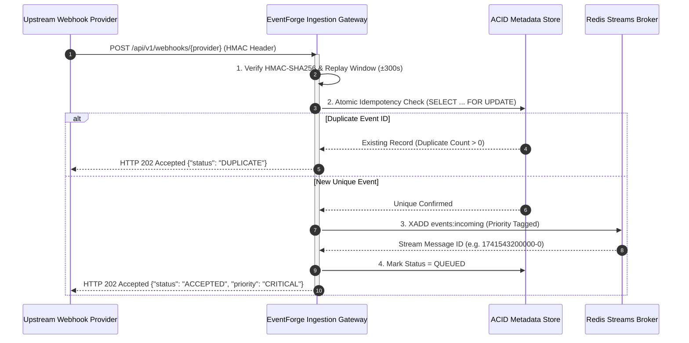
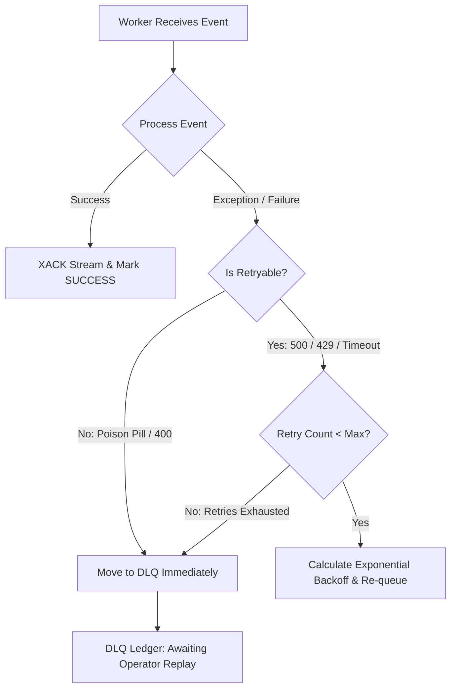

# EventForge — Distributed System Design Specification

> **High-Throughput Asynchronous Webhook & API Verification Gateway with Autonomous Adaptive Reliability**

---

## 1. Architectural Overview & Philosophy

Modern distributed architectures face an acute asymmetry between **external ingestion bursts** (e.g., flash sales, payment webhook floods, deployment webhooks) and **downstream processing capacity** (rate limits, third-party API quotas, database write latency).

Conventional webhook architectures that process payloads synchronously inside HTTP request handlers suffer from three fatal failure modes:
1. **HTTP Request Timeouts & Cascading Latency**: Upstream webhook providers (Stripe, GitHub, Razorpay) enforce strict 5–10s timeout windows. Slow downstream dependencies trigger timeouts, leading to aggressive upstream retries and self-inflicted DDoS storms.
2. **Cascading Downstream Collapse (Thundering Herd)**: When downstream systems experience intermittent 429 rate limits or 500 crashes, naive retry mechanisms amplify traffic pressure instead of shedding load.
3. **Message Loss & Duplicate Execution**: Uncoordinated worker crashes during in-flight processing lead to either lost events or duplicate financial charges.

### Core Architectural Invariant
```
[ Upstream Webhooks ] 
       │ (HTTP POST, <10ms SLA)
       ▼
[ FastAPI Ingestion Gateway ] ───► [ HMAC-SHA256 & Idempotency Filter ]
       │                                     │ (Reject duplicates & tampered)
       ▼ (Zero In-Flight Processing)         │
[ Redis Streams / In-Memory Broker ] ◄───────┘
       │
       ├───────────────────────────────────────────┐
       ▼                                           ▼
[ Adaptive Policy Control Loop ]          [ Consumer Group Fleet ]
  - Telemetry Monitor (Q, P95, 429)         - Worker 1..N (2 ↔ 8 Cores)
  - Finite State Machine Transitions        - Priority Channel Dispatch
  - Circuit Breaker Supervisor              - PEL Orphan Auto-Claim
       │                                           │
       ▼                                           ▼
[ Concurrency & Delay Scaling ]           [ ACID Store & Downstream API ]
```

---

## 2. Ingestion Subsystem (`<10ms` Budget)

### 2.1 Separation of Ingestion from Processing
The HTTP ingestion layer executes **zero business logic**. Its single responsibility is cryptographic validation, atomic idempotency recording, and queueing to a durable broker before returning an immediate `HTTP 202 Accepted` response.



### 2.2 Cryptographic Verification & Replay Protection
- **Stripe**: Computes HMAC-SHA256 over `f"{timestamp}.{raw_body}"` using constant-time comparison (`hmac.compare_digest`). Enforces a strict 300-second timestamp tolerance window to neutralize replay attacks.
- **GitHub**: Verifies `X-Hub-Signature-256` matching `sha256={hmac_hex}` over the raw binary payload.
- **Razorpay**: Validates `X-Razorpay-Signature` across authorization events.

---

## 3. Storage Layer & ACID Guarantees

EventForge supports both PostgreSQL (production) and SQLite with WAL mode (local/benchmark). 

### 3.1 Relational Schema Architecture

```
┌────────────────────────────────────────────────────────────────────────┐
│                                EVENTS                                  │
├──────────────────────────┬─────────────────────────┬───────────────────┤
│ id (BIGINT / PK)         │ event_id (VARCHAR UNIQUE│ provider (VARCHAR)│
│ event_type (VARCHAR)     │ priority (VARCHAR)      │ status (VARCHAR)  │
│ payload (JSON / JSONB)   │ headers (JSON / JSONB)  │ retry_count (INT) │
│ max_retries (INT)        │ received_at (TIMESTAMP) │ queued_at (TS)    │
│ started_at (TIMESTAMP)   │ completed_at (TIMESTAMP)│ duration_ms (FLT) │
│ error_message (TEXT)     │ is_duplicate (BOOLEAN)  │ dup_count (INT)   │
│ current_mode (VARCHAR)   │ stream_msg_id (VARCHAR) │                   │
└──────────────────────────┴─────────────────────────┴───────────────────┘
                                   │ 1
                                   │
                                   ▼ N
┌────────────────────────────────────────────────────────────────────────┐
│                            EVENT_ATTEMPTS                              │
├──────────────────────────┬─────────────────────────┬───────────────────┤
│ id (BIGINT / PK)         │ event_id (FK -> EVENTS) │ attempt_num (INT) │
│ worker_id (VARCHAR)      │ status (SUCCESS/FAILED) │ started_at (TS)   │
│ completed_at (TIMESTAMP) │ duration_ms (FLOAT)     │ error_msg (TEXT)  │
│ status_code (INT)        │ is_retryable (BOOLEAN)  │                   │
└──────────────────────────┴─────────────────────────┴───────────────────┘
```

### 3.2 Indexing Strategy
- `idx_events_provider_event_id`: Composite unique index preventing race-condition duplicates.
- `idx_events_status_priority`: Speeds up priority worker retrieval and DLQ isolation queries.
- `idx_events_received_at`: Powers rolling window telemetry and percentile calculations.

---

## 4. Asynchronous Queue & Consumer Fleet

### 4.1 Redis Streams & Consumer Groups
- **Stream Name**: `events:incoming`
- **Consumer Group**: `event-workers`
- **Delivery Guarantee**: At-least-once delivery with atomic Redis ACK (`XACK`) upon successful processing or DLQ transfer.

### 4.2 Pending Entries List (PEL) & Orphan Reclamation
If a worker crashes mid-execution, its claimed messages remain in the Redis PEL. The `WorkerManager` background liveness monitor periodically queries `XPENDING`:
1. Identifies messages unacknowledged for $>30\text{s}$.
2. Issues `XCLAIM` or re-assigns the message to an active healthy worker.
3. Ensures zero event loss during worker node crashes or network partitions.

---

## 5. Dead Letter Queue & Fault Isolation

Events that fail execution are bifurcated based on deterministic error classification:

| Error Category | HTTP Status / Exception | Action | Backoff |
| :--- | :--- | :--- | :--- |
| **Transient Downstream Failure** | 500, 502, 503, 504, Timeout | Scheduled for Retry | Exponential Jitter ($2.0s \cdot 2^{n} \cdot \mu$) |
| **Downstream Rate Limit** | 429 Too Many Requests | Retry with High Multiplier | Exponential Jitter ($3.0\times$ Multiplier) |
| **Non-Retryable Poison Pill** | 400 Bad Request, Malformed JSON, Schema Mismatch | Immediate DLQ Quarantine | No Retry |
| **Retry Exhaustion** | Exceeded Max Retries (5) | Quarantined to DLQ | Requires Manual / Script Replay |


